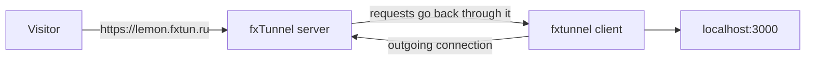

<p align="center">
  
</p>

<h1 align="center">fxTunnel</h1>

<p align="center">
  <strong>Expose localhost to the internet: HTTP, TCP and UDP tunnels, no public IP needed</strong>
</p>

<p align="center">
  <a href="https://github.com/mephistofox/fxtun.dev/releases/latest"></a>
  <a href="https://goreportcard.com/report/github.com/mephistofox/fxtun.dev"></a>
  <a href="LICENSE"></a>
  <a href="https://github.com/mephistofox/fxtun.dev/stargazers"></a>
</p>

<p align="center">
  <a href="https://fxtun.ru">Website</a> &bull;
  <a href="https://fxtun.ru/docs/quick-start">Docs</a> &bull;
  <a href="https://fxtun.ru/blog/">Blog</a> &bull;
  <a href="README_RU.md">Русский</a>
</p>

---

fxTunnel gives a service on your machine a public address. The client opens an outgoing connection to the fxTunnel server, and requests to your address come back through it to `localhost` — no public IP, no port forwarding, no router settings.

Use it to show a local site to a client, receive webhooks and OAuth callbacks during development, reach SSH, a database or RDP from outside, or host a game server for friends.

This repository is the open source code of the fxTunnel client: the `fxtunnel` command-line tool and the desktop app.

## Quick start

**1. Install**

```bash
# Linux, macOS
curl -fsSL https://fxtun.ru/install.sh | sh

# Windows (PowerShell)
irm https://fxtun.ru/install.ps1 | iex
```

Binaries for every platform are also on the [Releases](https://github.com/mephistofox/fxtun.dev/releases) page.

**2. Log in** — sign up at [fxtun.ru](https://fxtun.ru/register), then:

```bash
fxtunnel login
```

The client shows a short code; confirm it in the browser, and the token is saved.

**3. Open a tunnel**

```console
$ fxtunnel http 3000
  Connecting to fxtunnel server...
  Tunnel established!
  HTTP:  http://lemon.fxtun.ru
  HTTPS: https://lemon.fxtun.ru
  Forwarding to localhost:3000
  Ready to receive connections
```

`https://lemon.fxtun.ru` now serves your `localhost:3000`. Without `--domain` the subdomain is random and changes on every start.

> **Windows:** the first start of the `.exe` may show a SmartScreen warning — the binaries are not code-signed yet. Click **More info → Run anyway**. Release binaries are scanned with VirusTotal in CI.

## What it can do

- **HTTP and HTTPS** on a subdomain of `fxtun.ru`, WebSocket included: `fxtunnel http 3000`.
- **Stable addresses.** Pick a subdomain with `--domain myapp`; reserve it for yourself with `fxtunnel domains add myapp`; or connect your own domain with an automatic certificate (`fxtunnel domains custom add app.example.com --target myapp`).
- **TCP and UDP** — SSH, databases, RDP, game servers: `fxtunnel tcp 22`, `fxtunnel udp 19132`. The public address looks like `fxtun.ru:15432`.
- **Request inspector** at `http://127.0.0.1:4040`: every request and response through the tunnel, live, with one-click replay to your local service.
- **Access control.** `--auth user:password` puts a password on an HTTP tunnel; `--allow-ip 203.0.113.10` lets in only listed addresses (HTTP, TCP and UDP).
- **Temporary tunnels.** `--auto-close 30m` closes an idle tunnel, `--max-lifetime 8h` closes it after a set time.
- **Several tunnels in the background** from one config file: `fxtunnel up`, `fxtunnel status`, `fxtunnel down`.
- **Desktop app** for Linux, macOS and Windows: tunnels, history, saved bundles and the inspector without a terminal.

Commands and options are described in the [documentation](https://fxtun.ru/docs/quick-start); how-to guides are in the [blog](https://fxtun.ru/blog/).

## Plans

| | Free | Base | Pro | Business |
|---|:---:|:---:|:---:|:---:|
| Tunnels at the same time | 1 | 5 | 15 | 50 |
| HTTP, HTTPS, TCP | ✓ | ✓ | ✓ | ✓ |
| UDP | — | ✓ | ✓ | ✓ |
| Request inspector | — | ✓ | ✓ | ✓ |
| Reserved subdomains | — | 5 | 15 | 50 |
| Custom domains | — | 1 | 5 | 50 |

Prices and details: [fxtun.ru/pricing](https://fxtun.ru/pricing).

## How it works



The client connects out to `tunnel.fxtun.ru:443`; by default the channel is protected with TLS 1.2 and the server certificate is verified. Streams are multiplexed with [yamux](https://github.com/hashicorp/yamux) over the client's sessions with the server — one main session plus a few for data. Each HTTP or TCP connection from a visitor is a separate stream; a UDP tunnel uses one stream. Nothing on your side has to accept incoming connections.

## Building the client

```bash
make client   # command-line client → bin/fxtunnel
make gui      # desktop app (requires Wails)
make test     # tests
```

Requires Go 1.25+; the desktop app also needs Node.js and [Wails](https://wails.io).

## Self-hosting

The repository also contains the server code. Running your own server is possible but not supported: there is no installation guide or example configuration, and the code follows the needs of the fxtun.ru service.

## Contributing

Issues and pull requests are welcome. For anything larger than a small fix, open an issue first to discuss it.

## License

MIT with an attribution requirement — see [LICENSE](LICENSE). Any use, deployment or distribution must include visible attribution:

- GitHub: [github.com/mephistofox/fxtun.dev](https://github.com/mephistofox/fxtun.dev)
- Website: [fxtun.dev](https://fxtun.dev)
