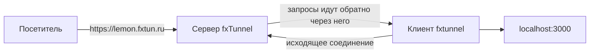

<p align="center">
  
</p>

<h1 align="center">fxTunnel</h1>

<p align="center">
  <strong>Откройте localhost в интернет: HTTP-, TCP- и UDP-туннели без белого IP</strong>
</p>

<p align="center">
  <a href="https://github.com/mephistofox/fxtun.dev/releases/latest"></a>
  <a href="https://goreportcard.com/report/github.com/mephistofox/fxtun.dev"></a>
  <a href="LICENSE"></a>
  <a href="https://github.com/mephistofox/fxtun.dev/stargazers"></a>
</p>

<p align="center">
  <a href="https://fxtun.ru">Сайт</a> &bull;
  <a href="https://fxtun.ru/docs/quick-start">Документация</a> &bull;
  <a href="https://fxtun.ru/blog/">Блог</a> &bull;
  <a href="README.md">English</a>
</p>

---

fxTunnel даёт сервису на вашем компьютере публичный адрес. Клиент сам открывает исходящее соединение с сервером fxTunnel, и запросы на ваш адрес приходят через него на `localhost`. Белый IP, проброс портов и настройка роутера не нужны.

Так можно показать заказчику сайт с ноутбука, принимать вебхуки и OAuth-колбэки во время разработки, зайти на SSH, базу или RDP снаружи, поднять игровой сервер для друзей.

Этот репозиторий — открытый код клиента fxTunnel: утилиты командной строки `fxtunnel` и десктопного приложения.

## Быстрый старт

**1. Установка**

```bash
# Linux, macOS
curl -fsSL https://fxtun.ru/install.sh | sh

# Windows (PowerShell)
irm https://fxtun.ru/install.ps1 | iex
```

Сборки под все платформы есть и на странице [Releases](https://github.com/mephistofox/fxtun.dev/releases).

**2. Вход** — зарегистрируйтесь на [fxtun.ru](https://fxtun.ru/register), затем:

```bash
fxtunnel login
```

Клиент покажет короткий код — подтвердите его в браузере, и токен сохранится.

**3. Туннель**

```console
$ fxtunnel http 3000
  Connecting to fxtunnel server...
  Tunnel established!
  HTTP:  http://lemon.fxtun.ru
  HTTPS: https://lemon.fxtun.ru
  Forwarding to localhost:3000
  Ready to receive connections
```

Теперь `https://lemon.fxtun.ru` открывает ваш `localhost:3000`. Без `--domain` поддомен случайный и при каждом запуске новый.

> **Windows:** при первом запуске `.exe` может появиться предупреждение SmartScreen — сборки пока без цифровой подписи. Нажмите **Подробнее → Выполнить в любом случае**. Файлы релизов проверяются в VirusTotal при сборке.

## Что умеет

- **HTTP и HTTPS** на поддомене `fxtun.ru`, включая WebSocket: `fxtunnel http 3000`.
- **Постоянный адрес.** Поддомен можно выбрать флагом `--domain myapp`, закрепить за собой командой `fxtunnel domains add myapp` или подключить свой домен с автоматическим сертификатом (`fxtunnel domains custom add app.example.com --target myapp`).
- **TCP и UDP** — SSH, базы данных, RDP, игровые серверы: `fxtunnel tcp 22`, `fxtunnel udp 19132`. Публичный адрес вида `fxtun.ru:15432`.
- **Инспектор запросов** на `http://127.0.0.1:4040`: все запросы и ответы через туннель вживую, повтор запроса в локальный сервис одним кликом.
- **Доступ.** `--auth user:password` закрывает HTTP-туннель паролем, `--allow-ip 203.0.113.10` пускает только указанные адреса (HTTP, TCP и UDP).
- **Временные туннели.** `--auto-close 30m` закрывает туннель после простоя, `--max-lifetime 8h` — через заданное время.
- **Несколько туннелей в фоне** по одному конфиг-файлу: `fxtunnel up`, `fxtunnel status`, `fxtunnel down`.
- **Десктопное приложение** для Linux, macOS и Windows: туннели, история, сохранённые наборы и инспектор без терминала.

Команды и флаги описаны в [документации](https://fxtun.ru/docs/quick-start), пошаговые инструкции — в [блоге](https://fxtun.ru/blog/).

## Тарифы

| | Free | Base | Pro | Business |
|---|:---:|:---:|:---:|:---:|
| Туннелей одновременно | 1 | 5 | 15 | 50 |
| HTTP, HTTPS, TCP | ✓ | ✓ | ✓ | ✓ |
| UDP | — | ✓ | ✓ | ✓ |
| Инспектор запросов | — | ✓ | ✓ | ✓ |
| Закреплённые поддомены | — | 5 | 15 | 50 |
| Свои домены | — | 1 | 5 | 50 |

Цены и подробности: [fxtun.ru/pricing](https://fxtun.ru/pricing).

## Как это устроено



Клиент подключается к `tunnel.fxtun.ru:443`; по умолчанию канал защищён TLS 1.2, сертификат сервера проверяется. Потоки мультиплексируются [yamux](https://github.com/hashicorp/yamux) внутри сессий клиента с сервером — основной и нескольких для данных. Каждое HTTP- или TCP-подключение посетителя — отдельный поток, у UDP-туннеля поток один. Принимать входящие подключения на вашей стороне ничего не должно.

## Сборка клиента

```bash
make client   # клиент командной строки → bin/fxtunnel
make gui      # десктопное приложение (нужен Wails)
make test     # тесты
```

Нужен Go 1.25+; для десктопного приложения — ещё Node.js и [Wails](https://wails.io).

## Свой сервер

В репозитории есть и код сервера. Развернуть свой сервер можно, но это не поддерживается: инструкции по установке и примера конфигурации нет, а код подчинён задачам сервиса fxtun.ru.

## Участие

Issue и pull request приветствуются. Если правка больше мелкого исправления, сначала откройте issue, чтобы её обсудить.

## Лицензия

MIT с требованием атрибуции — см. [LICENSE](LICENSE). При любом использовании, развёртывании или распространении нужна видимая ссылка на проект:

- GitHub: [github.com/mephistofox/fxtun.dev](https://github.com/mephistofox/fxtun.dev)
- Сайт: [fxtun.dev](https://fxtun.dev)
